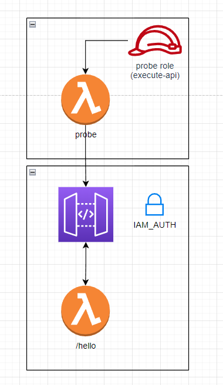

# IAM Auth API POC

Can we use IAM to protect microservices? 

The probe function acts as a consumer of the API service endpoint `/hello` and is granted access to `execute-api:Invoke` via IAM Role.
